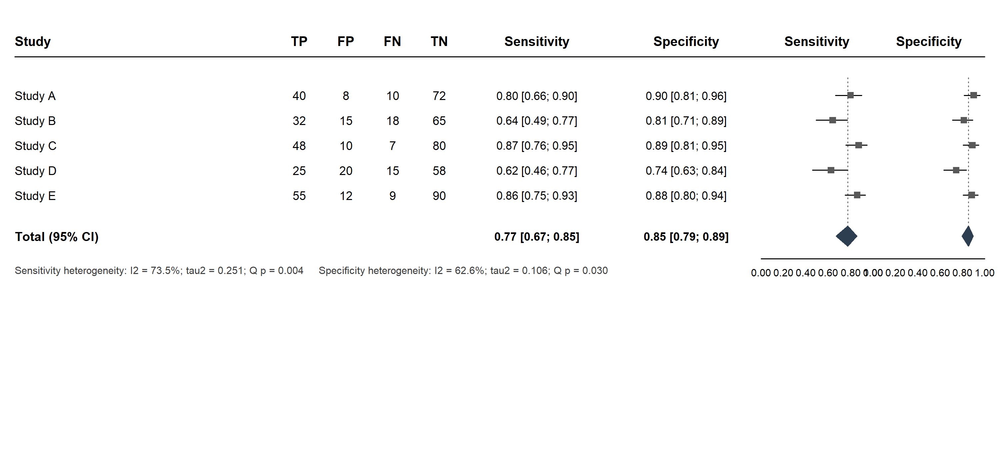
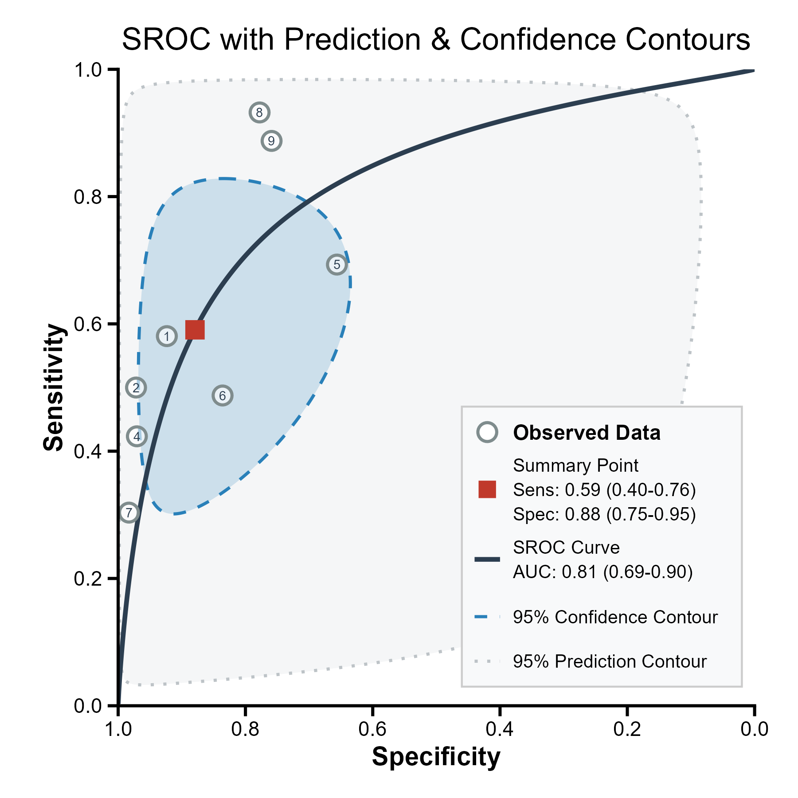

# dtaMetaBridge

`dtaMetaBridge` 用于衔接配对的 `meta::metaprop()` 对象与标准诊断试验准确性
meta 分析，提供双森林图、Reitsma 双变量随机效应模型、Rutter–Gatsonis HSROC 曲线和检验后概率。
1.0.0 默认调用 `mada::reitsma(method = "reml")` 与 `mada::sroc(type = "ruttergatsonis")`。

## 使用教程

### 安装

```r
install.packages("remotes")       # 只需安装一次
remotes::install_github("JinquanZhang/dtaMetaBridge")
library(dtaMetaBridge)
```

固定安装 v1.0.0：`remotes::install_github("JinquanZhang/dtaMetaBridge@v1.0.0")`。
更新后请重启 R，再加载包。三个主要函数都有独立中文帮助页，包含用法、参数和示例：

```r
?plot_sensspec_forest_meta
?plot_sroc
?posttest_probability
# 不加载包也可查询：
help("plot_sroc", package = "dtaMetaBridge")
packageVersion("dtaMetaBridge")
```

### 数据格式

每一行是一项研究，必须有研究名称及四格表计数：`TP`（真阳性）、`FP`（假阳性）、
`FN`（假阴性）、`TN`（真阴性）。

```r
dta <- data.frame(
  study = c("Parcha 2021", "Tada 2021", "Forsyth 2021", "Reddy 2022",
            "Ariyaratnam 2024", "Akerman 2025", "Wang 2023", "Nguyen 2025", "Rahi 2026"),
  TP = c(169,113,11,163,61,117,61,110,71), FP = c(29,5,16,3,11,42,2,36,27),
  FN = c(122,113,39,222,27,123,140,8,9), TN = c(350,173,11,99,21,214,116,126,85)
)
```

以上为原 QMD 的 H2 rule-in 输入，用于复现文件输出，不表示已重新核验各论文的四格表。

### 从 `meta` 对象开始：森林图、SROC 与 post-test probability

```r
library(meta)

# 1. 分别拟合灵敏度和特异度的单变量随机效应 GLMM。
meta_sens <- metaprop(TP, TP + FN, studlab = study, data = dta,
                      method = "GLMM", method.tau = "ML")
meta_spec <- metaprop(TN, TN + FP, studlab = study, data = dta,
                      method = "GLMM", method.tau = "ML")

# 2. 双森林图：菱形直接采用上述 meta 对象的随机效应汇总值。
plot_sensspec_forest_meta(meta_sens, meta_spec,
                           output_file = "forest.png")

# 3. Reitsma 双变量模型 + Rutter–Gatsonis HSROC（默认）。
fit <- fit_bivariate_meta(meta_sens, meta_spec)
plot_sroc(fit)

# 绘制完整的 Rutter-Gatsonis 曲线（包括观察范围外的模型外推）
plot_sroc(fit, full_curve = TRUE)

# 显式指定方法也可以：
# fit <- fit_bivariate_meta(meta_sens, meta_spec, sroc_type = "ruttergatsonis")

# 4. 按预检概率计算阳性和阴性后的患病概率及 95% 不确定性区间。
posttest_probability(fit, prevalence = c(0.10, 0.30, 0.50))
```

### 示例图

下图由上面的示例数据和函数生成。左图的森林图汇总值来自两个独立的
`meta::metaprop()` 随机效应模型；SROC 的方块来自联合 Reitsma 模型，故两组汇总
灵敏度/特异度数值可能略有差异，这是模型定义不同所致，并非计算不一致。

下表左侧为生成代码，右侧为对应输出图。代码使用上文的 `dta`、`meta_sens`、
`meta_spec` 和 `fit` 对象。

<table>
<tr><th>绘图代码</th><th>示例图</th></tr>
<tr>
<td><pre><code>plot_sensspec_forest_meta(
  meta_sens, meta_spec,
  output_file = "forest-example.png",
  width = 10, res = 300
)</code></pre></td>
<td></td>
</tr>
<tr>
<td><pre><code>plot_sroc(
  fit,
  output_file = "sroc-example.png",
  width = 6, height = 6, dpi = 300
)</code></pre></td>
<td></td>
</tr>
</table>

### 异质性与列宽调整

使用 `plot_sensspec_forest_meta()` 时，图底部会自动显示灵敏度和特异度各自的
`I2`、`tau2`、Cochran Q 和 p 值。研究方块面积在各面板内正比于对应 `meta` 对象的
随机效应权重 `w.random`（特异度权重按研究名称对齐），不再按样本量缩放。
GLMM 对象通常不提供该权重，此时明确警告并使用等大方块，不代表等权模型，也不会改动汇总结果。
需要实际权重的森林图时可另行拟合 `method = "Inverse"` 的模型；这会改变模型及汇总结果，不能只为改变图形而混用权重。
绘图顺序为灰色方块、完整 95% CI 横线、点估计短竖线，
汇总菱形为红色。`column_widths` 是一个命名数值向量；数值是各列的相对宽度，可按
版面需要调整。下例加宽研究名称和两张森林图区，并指定与示例图相同的坐标刻度：

```r
plot_sensspec_forest_meta(
  meta_sens, meta_spec,
  output_file = "forest-wide.png",
  sens_axis = seq(0.2, 1, 0.2),
  spec_axis = seq(0.4, 1, 0.2),
  column_widths = c(
    study = 3.2, tp = 0.45, fp = 0.45, fn = 0.45, tn = 0.45,
    sens_text = 1.5, spec_text = 1.5,
    sens_plot = 1.2, spec_plot = 1.2
  )
)
```

### 结果如何解释

### 字号、行距与颜色

以下新参数可直接传给 `plot_sensspec_forest_meta()`，均不改变统计结果：

```r
plot_sensspec_forest_meta(
  meta_sens, meta_spec,
  header_cex = 0.86,        # 表头
  study_cex = 0.72,         # 研究名称和四格表计数
  ci_text_cex = 0.68,       # 研究灵敏度/特异度及 CI 文字
  summary_cex = 0.78,      # Total 标签
  summary_count_cex = 0.75,# 汇总计数
  summary_ci_cex = 0.70,   # 汇总灵敏度/特异度及 CI 文字
  axis_cex = 0.68,         # 横轴刻度
  row_gap = NULL,          # 自动行距；9 项研究可尝试 0.05 或 0.06
  square_col = "grey70",   # 方块颜色
  square_max_mm = 5,       # 最大方块边长（毫米）
  ci_col = "black",        # CI 横线及点估计短竖线颜色
  ci_lwd = 1.2,            # CI 横线及短竖线粗细
  diamond_col = "#C00000"  # 汇总菱形颜色
)
```

上面列出的是默认值。所有 `cex` 均为相对字号，不是 pt。
`row_gap` 为图高比例，越大越疏；总研究行跨度不得超过图高的 0.52，
研究较多时需减小行距。汇总行和坐标轴会随研究行移动；手动指定的
`heterogeneity_y` 不会跟着移动，必要时改回 `NULL` 自动定位。
加大字体或方块仍可能造成重叠，可增大导出 `height` 并检查成图。

异质性文字可通过以下参数调整（不影响统计结果）：

森林图所有文字默认统一使用 `font_family = "serif"`，包括表头、研究名称、
数值、坐标刻度和异质性文字。可设为 `"sans"` 或 `"mono"`；其他字体需由
当前绘图设备支持。字体统一不改变各处字号及粗体层级。

```r
plot_sensspec_forest_meta(
  meta_sens, meta_spec,
  heterogeneity_cex = 0.8,          # 相对字号；默认 0.66，不是 pt
  font_family = "serif",           # 全图统一字体
  heterogeneity_x = 0.02,           # 两行左端位置：0 为最左，1 为最右
  heterogeneity_y = c(0.20, 0.15)   # 灵敏度、特异度；0 为底部，1 为顶部
)
```

`heterogeneity_y = NULL`（默认）会自动将两行放在汇总行下方。
手动位置不会自动避让其他元素；增大字体或移动文字后，请检查是否重叠或超出图边界。

- 森林图菱形：分别汇总灵敏度与特异度，适用于展示每个结局的异质性。
- SROC：默认 `sroc_type = "ruttergatsonis"`。以 REML 拟合 logit 灵敏度与 logit 假阳性率的双变量正态随机效应模型，按 HSROC 参数化生成曲线。默认连续性校正为 0.5，仅对含零单元格的研究实施。
- 曲线默认只显示观察到的 FPR 范围；完整 AUC 对同一曲线在 FPR 0–1 上积分，包含范围外的模型外推。`pauc` 是观察范围内的未标准化面积。
- AUC 区间暂不估计（`NA`）；图中置信轮廓针对联合汇总点，不是整条 SROC 的置信带。
- `qmd`、`midas`、`naive` 仅为显式可选方法；不是本文默认方法。
- `fit$metrics$auc`：跨研究的 SROC 区分能力汇总，不能替代单项研究中连续评分的 ROC AUC。
- post-test probability：区间反映汇总平均准确性的抽样不确定性，不是未来任一新场景的预测区间。

## 主要函数

### SROC 图形参数

以下参数适用于 `plot_sroc()` 的各绘图分支；`full_curve = TRUE` 仍仅支持
`ruttergatsonis`。不改变拟合模型、汇总数值或 AUC。

```r
plot_sroc(
  fit, full_curve = TRUE,
  show_confidence = TRUE, show_prediction = TRUE, show_legend = TRUE,
  legend_position = "bottomright", # bottomleft / topright / topleft 或 c(.54, .03)
  legend_text_size = 3.5, legend_bg = "#F8F9FA",
  font_family = "sans", base_size = 14,
  title = "SROC with Prediction & Confidence Contours", # NULL 隐藏标题
  show_study_labels = TRUE, study_size = 4, study_label_size = 2.5,
  summary_size = 4.5, summary_col = "#C0392B",
  sroc_col = "#2C3E50", sroc_linewidth = 1.2,
  confidence_col = "#2980B9", confidence_alpha = .2,
  prediction_col = "#BDC3C7", prediction_alpha = .15,
  digits = 2, auc_digits = 3,
  custom_se = NULL, custom_sp = NULL, custom_auc = NULL,
  x_breaks = seq(0, 1, .2), y_breaks = seq(0, 1, .2),
  output_file = "sroc.png", width = 6, height = 6, dpi = 300
)
```

`legend_position = c(x, y)` 指图例框左下角，按画面坐标定位：0 为最左/最底，
1 为最右/最顶，与倒序的特异度轴无关。图例宽度固定为图宽的 0.44，
高度随字号和内容行数调整；超出画面的设置会报错，长的自定义文本仍需检查是否溢出。
图例为手工注释，不能用 `theme(legend.position=...)` 移动。
`base_size` 单位是 pt，图例文字、点及编号大小是 mm；字体须被当前设备支持。
`alpha` 范围为 0–1，0 完全透明。刻度参数不改变轴范围。
`auc_digits = NULL` 时，QMD 沿用 `digits`，其他模型使用 3 位小数。
`custom_auc = NULL` 自动生成文字；区间未估计时仅显示 AUC 点估计，不显示 NA。
MIDAS 绘图现与其他分支共用渲染函数，也支持这些选项（其默认外观相应统一）。

| 函数 | 用途 |
| --- | --- |
| `dta_from_meta()` | 从匹配的灵敏度和特异度 `metaprop` 对象还原四格表。 |
| `plot_sensspec_forest_meta()` | 保留 `meta` 随机效应汇总菱形，绘制双森林图。 |
| `fit_bivariate_meta()` / `fit_bivariate_dta()` | 从 `meta` 对象或四格表拟合双变量模型；默认 Reitsma / Rutter–Gatsonis 方法。 |
| `fit_metandi()` / `plot_metandi()` | 保留原 QMD 函数供历史结果复现；不作为推荐默认算法。 |
| `plot_sroc()` | 绘制 HSROC 曲线、置信轮廓、预测轮廓和研究点。 |
| `posttest_probability()` | 计算不同预检概率下的 PPV、NPV 及模拟法 95% 区间。 |

## 方法与论文引用

推荐方法为 Reitsma 双变量模型及 Rutter–Gatsonis HSROC 参数化。实际估计使用
`mada` 的 logit 正态近似与 REML；不是直接拟合原始 Rutter–Gatsonis 论文的 Bayesian 模型。
Harbord 的参数映射适用于此处无协变量模型；这不代表不同似然与估计软件会得到相同数值。
少研究、稀疏数据或方差边界时应检查模型稳定性。

### 可用于论文的方法描述

采用 Reitsma 双变量随机效应模型联合汇总灵敏度与特异度，使用 R 包 mada 以限制性最大似然法估计。
根据无协变量双变量模型与 HSROC 的参数对应关系，以 Rutter–Gatsonis 参数化绘制 SROC 曲线。
含零单元格的研究使用 0.5 连续性校正；报告联合汇总点的 95% 置信区域和近似 95% 预测区域。
AUC 通过对拟合 SROC 曲线在假阳性率 0–1 范围内数值积分计算。

### 参考文献

1. Reitsma JB, et al. Bivariate analysis of sensitivity and specificity produces informative summary measures in diagnostic reviews. *J Clin Epidemiol*. 2005;58:982–990. [doi:10.1016/j.jclinepi.2005.02.022](https://doi.org/10.1016/j.jclinepi.2005.02.022)
2. Rutter CM, Gatsonis CA. A hierarchical regression approach to meta-analysis of diagnostic test accuracy evaluations. *Stat Med*. 2001;20:2865–2884. [doi:10.1002/sim.942](https://doi.org/10.1002/sim.942)
3. Harbord RM, et al. A unification of models for meta-analysis of diagnostic accuracy studies. *Biostatistics*. 2007;8:239–251. [doi:10.1093/biostatistics/kxl004](https://doi.org/10.1093/biostatistics/kxl004)

软件实现见 [mada 文档](https://search.r-project.org/CRAN/refmans/mada/help/reitsma-class.html)。
R 中可运行 `citation("dtaMetaBridge")` 查看方法文献，`citation("mada")` 查看软件引用。

本包不能替代研究方案、原始四格表核验或偏倚风险评价。
