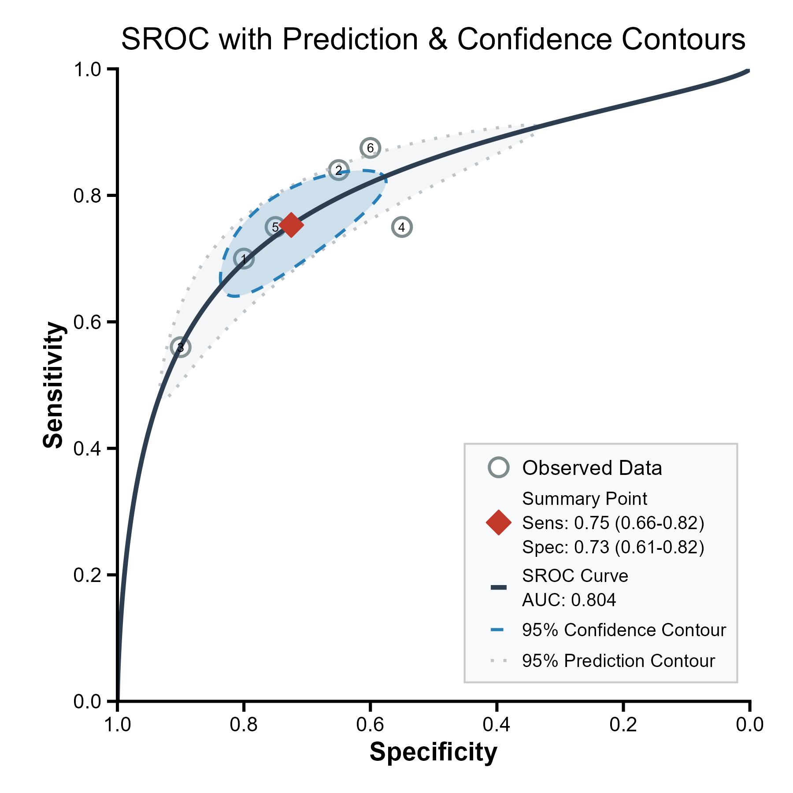
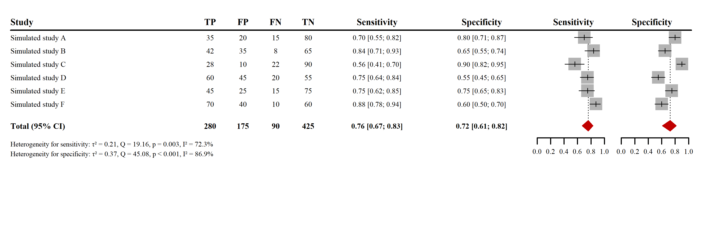

# dtaMetaBridge

`dtaMetaBridge` 是用于诊断试验准确性（DTA）Meta 分析的 R 包。它可将配对的 `meta::metaprop()` 对象还原为四格表，绘制灵敏度/特异度双森林图，拟合 SROC，并计算检验后概率。

## 功能

| 函数 | 作用 |
| --- | --- |
| `dta_from_meta()` | 从配对 `metaprop` 对象还原 `study`、TP、FP、FN、TN。 |
| `plot_sensspec_forest_meta()` | 用配对 `meta` 对象或四格表绘制双森林图。 |
| `fit_sroc()` | 由四格表拟合频率学或贝叶斯 SROC。 |
| `plot_sroc()` | 绘制 SROC、汇总点、置信/预测轮廓及研究点。 |
| `posttest_probability()` | 计算 PPV、NPV 与其模拟区间。 |

## 安装

```r
install.packages("remotes") # 仅需一次
remotes::install_github("JinquanZhang/dtaMetaBridge")
library(dtaMetaBridge)
```

`dtametaTMB`、`meta4diag` 和 `INLA` 已列为安装依赖；使用上述命令安装本包时会一并解析下载。INLA 使用其官方稳定仓库；若网络或单位镜像限制该仓库，请先配置可访问该地址的 R 软件源后重试。

## 基本工作流

每行必须是一项相互独立的研究，且含有研究名、TP、FP、FN、TN；四格表为非负整数，每项研究都必须至少包含一名患病与一名非患病受试者。

```r
dta <- read.csv("example-dta.csv")

fit <- fit_sroc(dta, year_col = "year", auc_boot = 2000)
fit$metrics
```

默认是直接频率学 Rutter–Gatsonis HSROC。AUC 默认进行 2,000 次研究层 Bootstrap 并给出 95% CI；默认使用至多 6 个物理核心。快速预览可关闭 Bootstrap：

```r
fit_fast <- fit_sroc(dta, year_col = "year", auc_boot = 0)
```

## SROC 模型

| 后端 | 区间 | SROC 类型 |
| --- | --- | --- |
| `"frequency"`（默认） | Se/Sp：Wald 95% CI；AUC：研究层 Bootstrap 95% CI。 | 仅类型 5，即原生 Rutter–Gatsonis。 |
| `"bayes"` | 后验 95% CrI。 | 可用类型 1–5。 |

```r
fit_freq <- fit_sroc(dta, backend = "frequency", year_col = "year",
                     auc_boot = 2000, n_cores = 6, seed = 2026)

fit_bayes <- fit_sroc(dta, backend = "bayes", year_col = "year",
                      sroc_type = 5, posterior_samples = 2000, seed = 2026)
```

频率学 CI 和贝叶斯 CrI 的概率解释不同，不能直接当作同一种区间比较。`fit$metrics` 包含 `sensitivity`、`specificity`、`auc` 以及观察 FPR 范围内的未标准化 `pauc`。

## 绘制 SROC

```r
plot_sroc(
  fit_freq,
  output_file = "sroc.png", width = 6, height = 6, dpi = 300,
  full_curve = TRUE,
  x_axis = "specificity", # 或 "fpr"，即 1 - Specificity
  study_col = "#7F8C8D", study_label_col = "black",
  summary_col = "#C0392B", sroc_col = "#2C3E50"
)
```



- 汇总点为菱形；研究圈在轮廓与 SROC 曲线下方，研究编号默认黑色。
- `x_axis = "specificity"`（默认）显示从 1 到 0 的特异度；`x_axis = "fpr"` 显示从 0 到 1 的 `1 - Specificity`。
- `full_curve = FALSE` 只显示观察到的 FPR 范围；`TRUE` 显示 FPR 0–1 的模型外推曲线。它们不改变拟合、AUC 或汇总估计。
- 置信轮廓描述联合汇总点的不确定性；预测轮廓描述未来研究的潜在真实准确性，不包含其有限样本的二项抽样误差；二者均不是整条曲线的置信带。
- 图例框会实测最长文字行宽度，并结合字号与目标输出尺寸自适应。若图形太小而不能完整容纳图例，函数会报错；请增大 `width`/`height` 或减小 `legend_text_size`。

常用外观设置：

```r
plot_sroc(
  fit_freq, title = "SROC", base_size = 12,
  show_study_labels = TRUE, study_size = 3.5, study_label_size = 2.3,
  confidence_col = "#2E86C1", confidence_alpha = .20,
  prediction_col = "grey70", prediction_alpha = .15,
  legend_position = "bottomright", legend_bg = "#F8F9FA",
  legend_text_size = 3.2
)
```

完整参数请运行 `?fit_sroc` 与 `?plot_sroc`。

## 双森林图

使用 `meta::metaprop()` 时，灵敏度对象的 `event/n` 必须是 TP/(TP + FN)，特异度对象必须是 TN/(TN + FP)。两个对象的研究名必须唯一且完全一致。

```r
library(meta)

meta_sens <- metaprop(TP, TP + FN, studlab = study, data = dta,
                      method = "GLMM", method.tau = "ML")
meta_spec <- metaprop(TN, TN + FP, studlab = study, data = dta,
                      method = "GLMM", method.tau = "ML")

dta_recovered <- dta_from_meta(meta_sens, meta_spec)
fit <- fit_sroc(dta_recovered, auc_boot = 2000)
```

```r
plot_sensspec_forest_meta(
  meta_sens, meta_spec,
  output_file = "sensspec_forest.png", width = 11, res = 300,
  column_widths = c(
    study = 2.8, tp = .5, fp = .5, fn = .5, tn = .5,
    sens_text = 1.6, spec_text = 1.6, sens_plot = 1.2, spec_plot = 1.2
  ),
  font_family = "serif", square_col = "grey70", square_max_mm = 5,
  ci_col = "black", diamond_col = "#C00000",
  heterogeneity_cex = .66, heterogeneity_x = .015
)
```



森林图菱形来自相应 `meta` 对象的随机效应汇总值。方块面积按各面板的 `w.random` 权重缩放；CI 横线与点估计短竖线位于方块上层。研究行区间为 Clopper–Pearson 精确二项区间，因此可能与 `meta` 对象所选的区间算法不同。

也可直接传入四格表：

```r
plot_sensspec_forest_meta(dta, use_meta_summary = FALSE)
```

完整森林图参数请运行 `?plot_sensspec_forest_meta`。

## 检验后概率

```r
posttest_probability(fit_freq, prevalence = c(.10, .30, .50),
                     n_sims = 3000, seed = 2026)
```

返回每个检验前概率下的汇总灵敏度、特异度、PPV、NPV 及模拟 95% 区间。阴性后的患病概率是 `1 - npv`。区间只反映汇总准确性的不确定性，不含检验前概率不确定性，也不是新研究预测区间。

## 引用

- Rutter CM, Gatsonis CA. A hierarchical regression approach to meta-analysis of diagnostic test accuracy evaluations. *Statistics in Medicine*. 2001;20:2865–2884. doi:10.1002/sim.942.
- Reitsma JB, et al. Bivariate analysis of sensitivity and specificity produces informative summary measures in diagnostic reviews. *Journal of Clinical Epidemiology*. 2005;58:982–990. doi:10.1016/j.jclinepi.2005.02.022.
